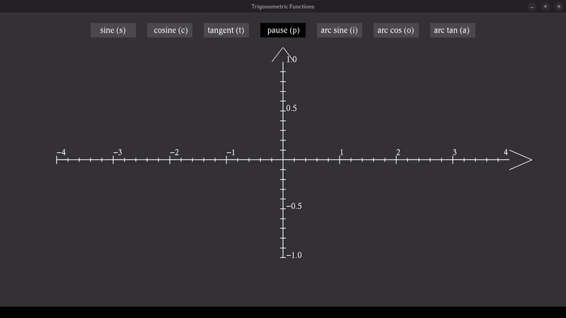

# Trigonometric Functions in OpenGL

A small program that lets you visualize multiple trigonometric functions, built in C++ with OpenGL and GLUT.  
Press the letter next to the name of a function to enable/disable it.

You need to have the `glut` library installed to be able to run this program. To install it on Fedora run

```bash
sudo dnf in freeglut freeglut-devel
```



